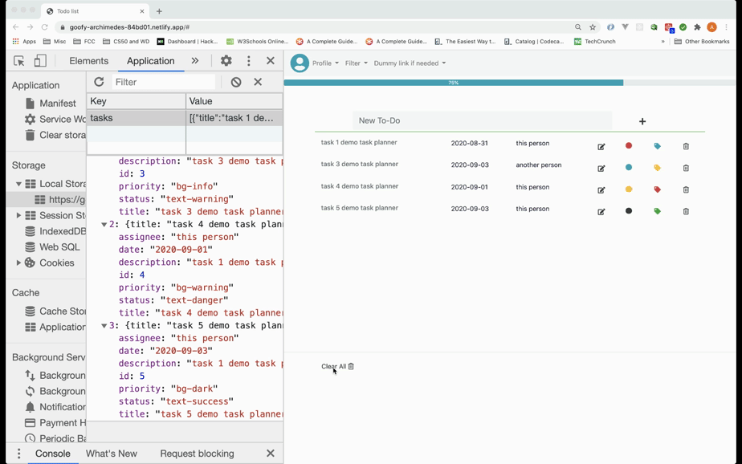
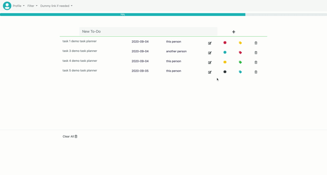

# Task Planner :

Basic Taskplanner inspired by the to-do list created in [Vue.js](https://vuejsexamples.com/advanced-to-do-list-application-built-with-vue-js/).

The app was created as part of [Generation Australia](https://australia.generation.org/programs/become-a-web-developer/) final assessment.

## Technical description :

### Languages and frameworks :

Task Planner is written with :

- HTML 5
- CSS 3
- Bootstrap 4.5
- Vanilla JS

It also uses :

- [Local storage](https://developer.mozilla.org/en-US/docs/Web/API/Window/localStorage) to keep the created, updated and deleted tasks saved in the browser. When the user opens Task planner, all the created tasks will be there.
- [Parcel.js](https://parceljs.org/getting_started.html) - web application bundler.

### Testing :

The app has been tested with [jest](https://jestjs.io/docs/en/getting-started).

### Demo :

To see the demo please follow the link [Task Planner](https://tender-payne-99092c.netlify.app/).

#### What it does and how it works:

- Creates task and validates content of the information in the form prior to creation of the task:
  |
  | ------ |
- Updates and deletes task - including in local storage:
  |
  | ------ |
- Stores tasks in Local storage see demo
- Clears all tasks :
  |
  | ------ |
- Filters tasks by priority and status :
  |
  | ------ |

## Getting started :

<!-- 0. Fork the repository -->

1. Clone repository to your local machine :

```
git clone https://github.com/YPatton86/TeamTaskList
```

2. Enter the folder TeamTaskList :

```
cd TeamTaskList
```

3. Run command to launch the project :

```
npm start
```

4. Add tests :

- use file task.test.js or taskmanager.test.js

- to run tests run the following command :

```
npm test
```

- add tests and wait for the results in the console.

## Authors :

- **Yumi Patton** - [Yumi's github](https://github.com/YPatton86)
- **Anastasia Gorodinskaya** - [Anastasia's github](https://github.com/agorodinskaya)

## Acknowledgments:

- Generation Australia
- Anindha Parthy
